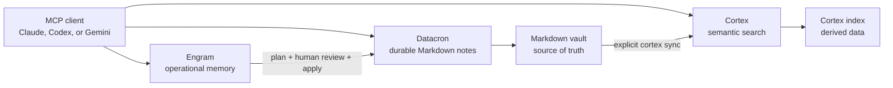

# Engram, Datacron, and Cortex

[Français](../fr/datacron-cortex.md) | [English](datacron-cortex.md)

> **Goal:** choose the right tool and make all three work over the same corpus.<br>
> **Time:** 10 minutes to read.<br>
> **Risk:** Datacron writes and Engram promotions require human review.<br>
> **Verified with:** Engram `2026.0730.02` on 2026-08-13.

## In 30 seconds

| Need | Tool | What it keeps |
| --- | --- | --- |
| Recover what matters for the current session | **Engram** | Bounded operational memory with trust and quarantine |
| Read or write durable knowledge | **Datacron** | Canonical Markdown files, history, and audit |
| Find an idea across many Markdown or PDF files | **Cortex** | A derived semantic index rebuilt from documents |

The most important rule:

> **The Markdown vault served by Datacron is the durable source. Cortex is a derived index. An
> Engram memory becomes trusted only after review and attestation.**

## What is actually connected



- Engram talks directly to Datacron only during consolidation commands.
- Engram never calls Cortex.
- Datacron and Cortex are normally separate `stdio` MCP servers registered in the same client.
- Cortex can index the Datacron vault when its `kb_path` points to that folder.
- A Datacron write does not trigger `cortex sync`. Cortex may lag until the next sync.

## Which tool should I use?

| Your question | Start with |
| --- | --- |
| "Where did we stop on this project?" | Engram MCP tool `recall` |
| "Which decision should guide this session?" | Engram MCP tool `recall` |
| "What is the canonical note or its exact path?" | Datacron MCP tools `search_text`, then `get_note` |
| "Which documents discuss this idea using different words?" | MCP tool `cortex_search` |
| "I must create or correct a durable note." | an authorized Datacron write tool |
| "This session fact may be worth retaining." | Engram MCP tool `remember`, followed by later review |
| "The vault changed and semantic search must see it." | CLI `cortex sync`, then MCP tool `cortex_freshness` |

For an important action, always reread the Datacron note itself. A Cortex hit is a retrieved
passage, not a new source of truth.

## Set up a shared vault

Replace `G:/Knowledge` with the absolute path to your vault.

### 1. Initialize Datacron

```text
datacron setup --vault "G:/Knowledge" --client all --scope both
datacron status --vault "G:/Knowledge"
```

**Expected result:** the vault is initialized and indexed. Write tools remain disabled until an
explicit allowlist enables them.

### 2. Authorize only the Engram consolidation folder

In `engram.toml`:

```toml
[datacron]
command = "datacron"
args = ["mcp", "serve"]
vault_root = "G:/Knowledge"
read_paths = ["G:/Knowledge"]
write_paths = ["G:/Knowledge/_memory/engram"]
new_note_directory = "_memory/engram"
neighbor_limit = 8
startup_timeout_ms = 10000
request_timeout_ms = 30000
shutdown_timeout_ms = 5000
```

**Expected result:** Engram's private gateway can read the vault and create notes only under
`_memory/engram`.

An empty `write_paths = []` blocks every write even when the parent process already authorizes
Datacron. This is the expected fail-closed behavior.

### 3. Point Cortex at the same folder

Run the Cortex assistant and select `G:/Knowledge` as `kb_path`:

```text
cortex setup
cortex sync
```

**Expected result:** Cortex builds its local index from the vault. Keep `.datacron` excluded: it
contains derived state, not notes to search.

To make `_memory/engram` searchable, choose whole-folder mode or explicitly add `_memory` to
`included_sections` in sections mode. When those memories should not enter the semantic corpus,
leave that folder out of scope and do not expect Cortex to retrieve them.

In an MCP client, call `cortex_list_sections` to verify coverage, then `cortex_freshness` to see
fresh, stale, and unindexed files. `cortex sync` is a CLI command; the other two names are MCP
tools.

## Recommended daily cycle

### Start a task

1. Call the Engram `recall` tool with the project, task, and a few subjects.
2. When the capsule cites durable knowledge, reread its Datacron source.
3. When the question spans a large corpus or paraphrases, use `cortex_search`.

**You can proceed when:** `notes.recall_complete` has been checked and every critical source has
been verified.

### Make information durable

```text
remember
  -> own_pending candidate
  -> human review and attestation
  -> consolidate --plan
  -> approve/reject decision
  -> consolidate --apply
  -> reverified Datacron note
  -> cortex sync
```

Exact operator steps are in
[Consolidate into Datacron](operator-guide.md#consolidate-into-datacron).

Do not jump directly from `own_pending` to Datacron. A quarantined candidate is unconfirmed and
cannot be consolidated.

### Correct information

1. Correct the canonical source in Datacron using Datacron history and controls.
2. Run the `cortex sync` CLI command to update the derived index.
3. Stop the Engram daemon with `uv run --python 3.14.6 engram stop`.
4. If Engram contains a conflicting active version, follow
   [Attest a candidate](operator-guide.md#attest-a-candidate) to identify the replaced entry or
   link both entries.
5. Run `uv run --python 3.14.6 engram consolidate --check-freshness`, then restart the daemon.

## If one component fails

| Failure | What continues | What not to conclude |
| --- | --- | --- |
| Engram unavailable | Datacron and Cortex remain usable | No capsule does not mean no knowledge |
| Datacron unavailable | Engram recall and Cortex search may work | Do not consolidate or change the durable source |
| Cortex unavailable | Engram and Datacron continue | A failed semantic search does not prove a document is absent |
| Cortex stale | Datacron files remain canonical | An old Cortex passage must not replace the current note |

## What is not automated

- no direct Engram-to-Cortex synchronization;
- no Datacron-to-Cortex runtime call;
- no Cortex watcher reindexing every change;
- no automatic attestation of Engram candidates;
- no document writing through Cortex;
- no forced promotion when Datacron changed after planning.

## Final check

- [ ] All three servers are registered separately in the intended client.
- [ ] Engram stays on a loopback IP or behind an authenticated proxy.
- [ ] Datacron writes are limited to explicit paths.
- [ ] Cortex indexes documents, not `.datacron`.
- [ ] A `cortex sync` follows each batch of vault changes.
- [ ] A person reviews every attestation and consolidation plan.

References: [Datacron](https://github.com/VBlackJack/Datacron) and
[Cortex](https://github.com/VBlackJack/Cortex).
