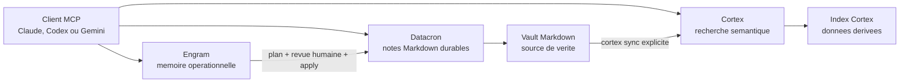

# Engram, Datacron et Cortex

[Francais](datacron-cortex.md) | [English](../en/datacron-cortex.md)

> **Objectif :** savoir quel outil utiliser et comment les faire travailler sur le meme corpus.<br>
> **Temps :** 10 minutes de lecture.<br>
> **Risque :** les ecritures Datacron et les promotions Engram exigent une revue humaine.<br>
> **Verifie avec :** Engram `2026.0730.02`, le 2026-07-30.

## En 30 secondes

| Besoin | Outil | Ce qu'il conserve |
| --- | --- | --- |
| Retrouver ce qui compte pour la session en cours | **Engram** | Memoire operationnelle bornee, avec confiance et quarantaine |
| Lire ou ecrire une connaissance durable | **Datacron** | Fichiers Markdown canoniques, historique et audit |
| Retrouver une idee dans beaucoup de Markdown ou de PDF | **Cortex** | Index semantique derive, reconstruit depuis les documents |

La regle la plus importante :

> **Le vault Markdown servi par Datacron est la source durable. Cortex est un index derive. Un
> souvenir Engram ne devient trusted qu'apres revue et attestation.**

## Ce qui est reellement connecte



- Engram parle directement a Datacron uniquement pendant les commandes de consolidation.
- Engram n'appelle jamais Cortex.
- Datacron et Cortex sont normalement deux serveurs MCP `stdio` separes, enregistres dans le meme
  client.
- Cortex peut indexer le vault Datacron si son `kb_path` pointe vers ce dossier.
- Une ecriture Datacron ne declenche pas `cortex sync`. Jusqu'au prochain sync, Cortex peut etre en
  retard.

## Quel outil utiliser ?

| Votre question | Commencer par |
| --- | --- |
| "Ou en etions-nous sur ce projet ?" | outil MCP Engram `recall` |
| "Quelle decision doit guider cette session ?" | outil MCP Engram `recall` |
| "Quelle est la note canonique ou son chemin exact ?" | outils MCP Datacron `search_text`, puis `get_note` |
| "Dans quels documents parle-t-on de cette idee, meme avec d'autres mots ?" | outil MCP `cortex_search` |
| "Je dois creer ou corriger une note durable." | un outil d'ecriture Datacron autorise |
| "Cette information de session merite peut-etre d'etre gardee." | outil MCP Engram `remember`, puis revue plus tard |
| "Le vault vient de changer et la recherche semantique doit le voir." | CLI `cortex sync`, puis outil MCP `cortex_freshness` |

Pour une action importante, relisez toujours la note Datacron elle-meme. Un hit Cortex est un
passage retrouve, pas une nouvelle source de verite.

## Mise en place avec un vault commun

Remplacez `G:/Knowledge` par le chemin absolu de votre vault.

### 1. Initialiser Datacron

```powershell
datacron setup --vault "G:/Knowledge" --client all --scope both
datacron status --vault "G:/Knowledge"
```

**Resultat attendu :** le vault est initialise et indexe. Les outils d'ecriture restent
desactives tant qu'aucune allowlist explicite ne les autorise.

### 2. Autoriser uniquement le dossier de consolidation Engram

Dans `engram.toml` :

```toml
[datacron]
command = "datacron"
args = ["mcp", "serve"]
vault_root = "G:/Knowledge"
read_paths = ["G:/Knowledge"]
write_paths = ["G:/Knowledge/_memory/engram"]
new_note_directory = "_memory/engram"
neighbor_limit = 8
startup_timeout_ms = 10000
request_timeout_ms = 30000
shutdown_timeout_ms = 5000
```

**Resultat attendu :** le gateway prive d'Engram peut lire le vault et creer uniquement sous
`_memory/engram`.

Une liste `write_paths = []` bloque toute ecriture, meme si le processus parent autorise deja
Datacron. C'est le comportement fail-closed attendu.

### 3. Pointer Cortex vers le meme dossier

Lancez l'assistant Cortex et choisissez `G:/Knowledge` comme `kb_path` :

```powershell
cortex setup
cortex sync
```

**Resultat attendu :** Cortex construit son index local depuis le vault. Le dossier `.datacron`
doit rester exclu : il contient des donnees derivees, pas les notes a chercher.

Pour rendre `_memory/engram` cherchable, choisissez le mode dossier entier ou ajoutez explicitement
`_memory` a `included_sections` en mode sections. Si ces souvenirs ne doivent pas entrer dans le
corpus semantique, laissez ce dossier hors perimetre et n'attendez pas que Cortex les retrouve.

Dans un client MCP, appelez `cortex_list_sections` pour verifier le perimetre, puis
`cortex_freshness` pour voir les fichiers frais, stale ou non indexes. `cortex sync` est une
commande CLI ; les deux autres noms sont des outils MCP.

## Cycle quotidien recommande

### Commencer une tache

1. Appelez l'outil Engram `recall` avec le projet, la tache et quelques sujets.
2. Si la capsule cite une connaissance durable, relisez sa source Datacron.
3. Si la question porte sur un corpus large ou une paraphrase, utilisez `cortex_search`.

**Vous pouvez travailler quand :** `notes.recall_complete` a ete lu et toute source critique a ete
verifiee.

### Rendre une information durable

```text
remember
  -> candidat own_pending
  -> revue et attestation humaines
  -> consolidate --plan
  -> decision approve/reject
  -> consolidate --apply
  -> note Datacron reverifiee
  -> cortex sync
```

Les etapes operateur exactes sont dans
[Consolider vers Datacron](operator-guide.md#consolider-vers-datacron).

Ne sautez pas directement de `own_pending` a Datacron. Un candidat en quarantaine n'est pas
confirme et ne peut pas etre consolide.

### Corriger une information

1. Corrigez la source canonique dans Datacron, avec l'historique et les controles Datacron.
2. Lancez la commande CLI `cortex sync` pour mettre a jour l'index derive.
3. Arretez le daemon Engram.
4. Si Engram contient une version active contraire, suivez
   [Attester un candidat](operator-guide.md#attester-un-candidat) pour indiquer l'entree remplacee
   ou relier les deux entrees.
5. Executez `uv run --python 3.14.3 engram consolidate --check-freshness`, puis redemarrez le
   daemon.

## Si un composant tombe en panne

| Panne | Ce qui continue | Ce qu'il ne faut pas conclure |
| --- | --- | --- |
| Engram indisponible | Datacron et Cortex restent utilisables | L'absence de capsule ne signifie pas absence de connaissance |
| Datacron indisponible | Recall Engram et recherche Cortex peuvent fonctionner | Ne pas consolider ni modifier la source durable |
| Cortex indisponible | Engram et Datacron continuent | Une recherche semantique ratee ne prouve pas qu'un document n'existe pas |
| Cortex stale | Les fichiers Datacron restent canoniques | Un ancien passage Cortex ne doit pas remplacer la note actuelle |

## Ce qui n'est pas automatise

- aucune synchronisation directe Engram vers Cortex ;
- aucun appel runtime Datacron vers Cortex ;
- aucun watcher Cortex qui reindexe chaque modification ;
- aucune attestation automatique des candidats Engram ;
- aucune ecriture de document par Cortex ;
- aucune promotion forcee si Datacron a change depuis le plan.

## Verification finale

- [ ] Les trois serveurs sont enregistres separement dans le client voulu.
- [ ] Engram reste sur une adresse IP loopback ou derriere un proxy authentifie.
- [ ] Les ecritures Datacron sont limitees a des chemins explicites.
- [ ] Cortex indexe les documents, pas `.datacron`.
- [ ] Un `cortex sync` est prevu apres chaque lot de changements du vault.
- [ ] Une personne relit toute attestation et tout plan de consolidation.

References : [Datacron](https://github.com/VBlackJack/Datacron) et
[Cortex](https://github.com/VBlackJack/Cortex).
