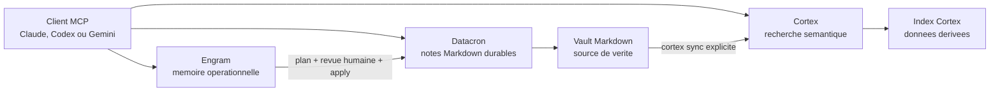

# Engram, Datacron et Cortex

[Français](datacron-cortex.md) | [English](../en/datacron-cortex.md)

> **Objectif :** savoir quel outil utiliser et comment les faire travailler sur le même corpus.<br>
> **Temps :** 10 minutes de lecture.<br>
> **Risque :** les écritures Datacron et les promotions Engram exigent une revue humaine.<br>
> **Vérifié avec :** Engram `2026.0730.02`, le 2026-08-13.

## En 30 secondes

| Besoin | Outil | Ce qu'il conserve |
| --- | --- | --- |
| Retrouver ce qui compte pour la session en cours | **Engram** | Mémoire opérationnelle bornée, avec confiance et quarantaine |
| Lire ou écrire une connaissance durable | **Datacron** | Fichiers Markdown canoniques, historique et audit |
| Retrouver une idée dans beaucoup de Markdown ou de PDF | **Cortex** | Index sémantique dérivé, reconstruit depuis les documents |

La règle la plus importante :

> **Le vault Markdown servi par Datacron est la source durable. Cortex est un index dérivé. Un
> souvenir Engram ne devient trusted qu'après revue et attestation.**

## Ce qui est réellement connecté



- Engram parle directement à Datacron uniquement pendant les commandes de consolidation.
- Engram n'appelle jamais Cortex.
- Datacron et Cortex sont normalement deux serveurs MCP `stdio` séparés, enregistrés dans le même
  client.
- Cortex peut indexer le vault Datacron si son `kb_path` pointe vers ce dossier.
- Une écriture Datacron ne déclenche pas `cortex sync`. Jusqu'au prochain sync, Cortex peut être en
  retard.

## Quel outil utiliser ?

| Votre question | Commencer par |
| --- | --- |
| « Où en étions-nous sur ce projet ? » | outil MCP Engram `recall` |
| « Quelle décision doit guider cette session ? » | outil MCP Engram `recall` |
| « Quelle est la note canonique ou son chemin exact ? » | outils MCP Datacron `search_text`, puis `get_note` |
| « Dans quels documents parle-t-on de cette idée, même avec d'autres mots ? » | outil MCP `cortex_search` |
| « Je dois créer ou corriger une note durable. » | un outil d'écriture Datacron autorisé |
| « Cette information de session mérite peut-être d'être gardée. » | outil MCP Engram `remember`, puis revue plus tard |
| « Le vault vient de changer et la recherche sémantique doit le voir. » | CLI `cortex sync`, puis outil MCP `cortex_freshness` |

Pour une action importante, relisez toujours la note Datacron elle-même. Un hit Cortex est un
passage retrouvé, pas une nouvelle source de vérité.

## Mise en place avec un vault commun

Remplacez `G:/Knowledge` par le chemin absolu de votre vault.

### 1. Initialiser Datacron

```text
datacron setup --vault "G:/Knowledge" --client all --scope both
datacron status --vault "G:/Knowledge"
```

**Résultat attendu :** le vault est initialisé et indexé. Les outils d'écriture restent
désactivés tant qu'aucune allowlist explicite ne les autorise.

### 2. Autoriser uniquement le dossier de consolidation Engram

Dans `engram.toml` :

```toml
[datacron]
command = "datacron"
args = ["mcp", "serve"]
vault_root = "G:/Knowledge"
read_paths = ["G:/Knowledge"]
write_paths = ["G:/Knowledge/_memory/engram"]
new_note_directory = "_memory/engram"
neighbor_limit = 8
startup_timeout_ms = 10000
request_timeout_ms = 30000
shutdown_timeout_ms = 5000
```

**Résultat attendu :** le gateway privé d'Engram peut lire le vault et créer uniquement sous
`_memory/engram`.

Une liste `write_paths = []` bloque toute écriture, même si le processus parent autorise déjà
Datacron. C'est le comportement fail-closed attendu.

### 3. Pointer Cortex vers le même dossier

Lancez l'assistant Cortex et choisissez `G:/Knowledge` comme `kb_path` :

```text
cortex setup
cortex sync
```

**Résultat attendu :** Cortex construit son index local depuis le vault. Le dossier `.datacron`
doit rester exclu : il contient des données dérivées, pas les notes à chercher.

Pour rendre `_memory/engram` cherchable, choisissez le mode dossier entier ou ajoutez explicitement
`_memory` à `included_sections` en mode sections. Si ces souvenirs ne doivent pas entrer dans le
corpus sémantique, laissez ce dossier hors périmètre et n'attendez pas que Cortex les retrouve.

Dans un client MCP, appelez `cortex_list_sections` pour vérifier le périmètre, puis
`cortex_freshness` pour voir les fichiers frais, stale ou non indexés. `cortex sync` est une
commande CLI ; les deux autres noms sont des outils MCP.

## Cycle quotidien recommandé

### Commencer une tâche

1. Appelez l'outil Engram `recall` avec le projet, la tâche et quelques sujets.
2. Si la capsule cite une connaissance durable, relisez sa source Datacron.
3. Si la question porte sur un corpus large ou une paraphrase, utilisez `cortex_search`.

**Vous pouvez travailler quand :** `notes.recall_complete` a été lu et toute source critique a été
vérifiée.

### Rendre une information durable

```text
remember
  -> candidat own_pending
  -> revue et attestation humaines
  -> consolidate --plan
  -> decision approve/reject
  -> consolidate --apply
  -> note Datacron reverifiee
  -> cortex sync
```

Les étapes opérateur exactes sont dans
[Consolider vers Datacron](operator-guide.md#consolider-vers-datacron).

Ne sautez pas directement de `own_pending` à Datacron. Un candidat en quarantaine n'est pas
confirmé et ne peut pas être consolidé.

### Corriger une information

1. Corrigez la source canonique dans Datacron, avec l'historique et les contrôles Datacron.
2. Lancez la commande CLI `cortex sync` pour mettre à jour l'index dérivé.
3. Arrêtez le démon Engram avec `uv run --python 3.14.6 engram stop`.
4. Si Engram contient une version active contraire, suivez
   [Attester un candidat](operator-guide.md#attester-un-candidat) pour indiquer l'entrée remplacée
   ou relier les deux entrées.
5. Exécutez `uv run --python 3.14.6 engram consolidate --check-freshness`, puis redémarrez le
   démon.

## Si un composant tombe en panne

| Panne | Ce qui continue | Ce qu'il ne faut pas conclure |
| --- | --- | --- |
| Engram indisponible | Datacron et Cortex restent utilisables | L'absence de capsule ne signifie pas absence de connaissance |
| Datacron indisponible | Recall Engram et recherche Cortex peuvent fonctionner | Ne pas consolider ni modifier la source durable |
| Cortex indisponible | Engram et Datacron continuent | Une recherche sémantique ratée ne prouve pas qu'un document n'existe pas |
| Cortex stale | Les fichiers Datacron restent canoniques | Un ancien passage Cortex ne doit pas remplacer la note actuelle |

## Ce qui n'est pas automatisé

- aucune synchronisation directe Engram vers Cortex ;
- aucun appel runtime Datacron vers Cortex ;
- aucun watcher Cortex qui réindexe chaque modification ;
- aucune attestation automatique des candidats Engram ;
- aucune écriture de document par Cortex ;
- aucune promotion forcée si Datacron a changé depuis le plan.

## Vérification finale

- [ ] Les trois serveurs sont enregistrés séparément dans le client voulu.
- [ ] Engram reste sur une adresse IP loopback ou derrière un proxy authentifié.
- [ ] Les écritures Datacron sont limitées à des chemins explicites.
- [ ] Cortex indexe les documents, pas `.datacron`.
- [ ] Un `cortex sync` est prévu après chaque lot de changements du vault.
- [ ] Une personne relit toute attestation et tout plan de consolidation.

Références : [Datacron](https://github.com/VBlackJack/Datacron) et
[Cortex](https://github.com/VBlackJack/Cortex).
